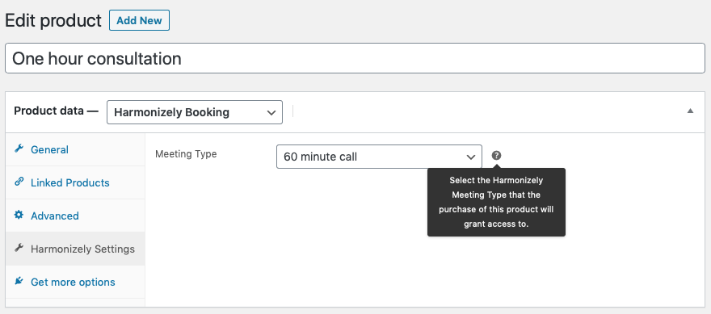
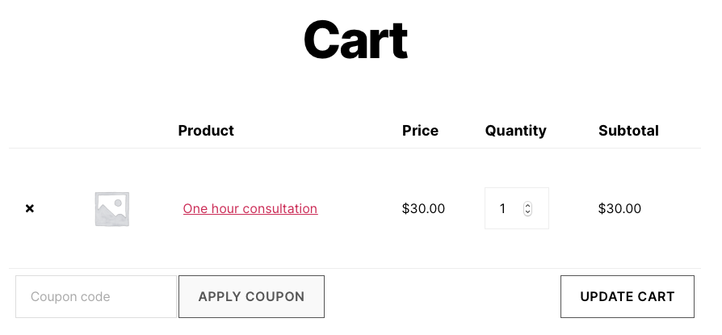
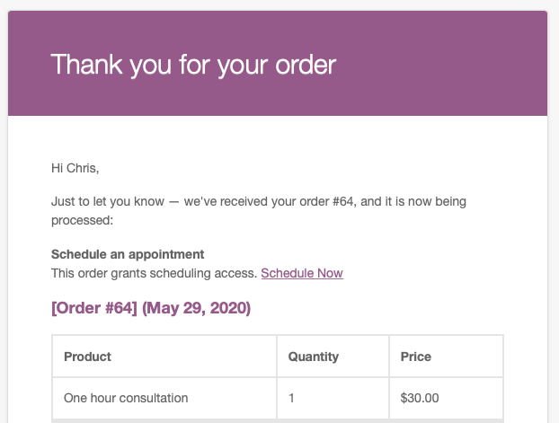

# Harmonizely Booking Product

> Creates a Harmonizely appointment booking product type for WooCommerce.

    

## Description

Harmonizely is a service that allows you to connect your calendar and allow people to easily schedule appointments with you. The Harmonizely Booking Product plugin for WordPress and WooCommerce enables selling access to Harmonizely appointment scheduling. You create an appointment booking product, set the price and choose which Harmonizely meeting type to use. Then, your customers can pay for an appointment and use a personalized, one-time scheduling link to complete the scheduling process.

This plugin requires a Harmonizely account and API key. If you don't have a Harmonizely account, [sign up for free](https://harmonizely.com?fpr=chris39). (This is an affiliate link; commissions from any resulting purchases will help support this plugin's development.) To get your Harmonizely API key, visit [the Integrations page in your account](https://harmonizely.com/integrations). This plugin is not affiliated with or supported by Harmonizely; I'm just a Harmonizely user who is excited to integrate it with other tools like WordPress and WooCommerce.

See the [plugin's page in the WordPress.org plugin directory](https://wordpress.org/plugins/harmonizely-booking-product/) for more information on configuring and customizing.

### Harmonizely product configuration

### Example booking product during checkout

### Example appointment scheduling link delivery

## Requirements

* [WordPress](http://wordpress.org) 5.2.2+
* [WooCommerce](https://woocommerce.com) 3.0+
* [Harmonizely account](https://harmonizely.com?fpr=chris39)

## Installation

Harmonizely Booking Product is most easily installed via the Plugins tab in your admin dashboard.

## Support Level

**Inactive:** I no longer actively maintain this project, and do not expect to provide any additional updates or features, including testing against newer versions of WordPress. Bug reports, questions, and pull requests are welcome but may not be handled or responded to in a timely manner or at all.

## Contributing

Pull requests and issues on [GitHub](https://github.com/ChrisHardie/harmonizely-booking-product) are welcome.